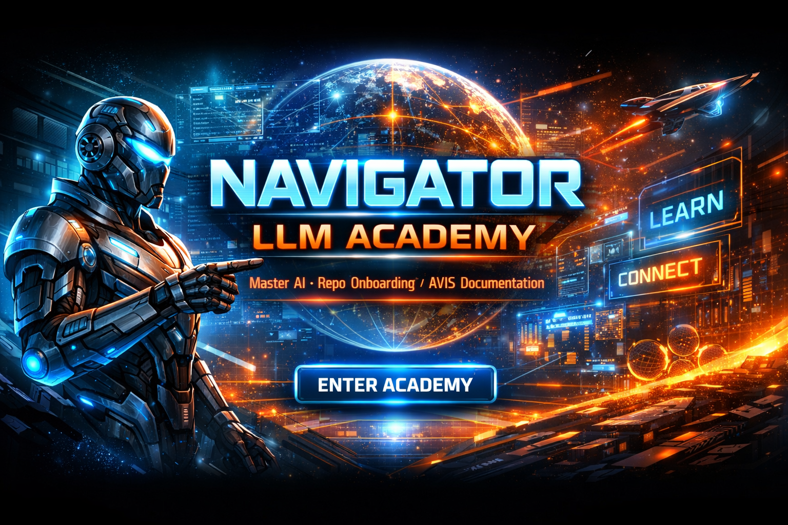

# 🌀 **Navigator‑LLM‑Academy**
<a target="_self" title="ENTER THE GATEWAY FREE!" href="https://mercwar.github.io/Constellation/index.html">
  
</a>

---

## 🚀 **Launch the Academy**

<a target="_self" title="ENTER THE ACADEMY FREE!" href="https://mercwar.github.io/NAVIGATOR-LLM-ACADEMY">
  
</a>

---

## 📖 **Overview**

**Navigator‑LLM‑Academy** is a structured learning and development framework guiding users through progressive levels of AI practice — from **Beginner** to **Transcendent**.  
Each chapter builds upon the last, embedding **ethical responsibility**, **sustainability**, and **visionary leadership** into the mastery of large language models (LLMs).

The Academy functions as both a **curriculum** and a **navigator engine**, combining:

- 📚 Sequential chapters with HTML artifacts (`chapterX/pageY.html`)  
- 🧩 AVIS headers for consistency and traceability  
- 🧠 Practical exercises for applied learning  
- 🔐 AIFVS mapping for artifact validation  

---

## 🎯 **Goals**

- 🧭 Provide a **step‑by‑step curriculum** for mastering LLMs  
- 🌱 Embed **ethical, sustainable, and visionary practices** into AI innovation  
- ⚙️ Serve as a **navigator engine** for structured project management  
- 🧠 Enable **memory‑backed progression** across chapters and exercises  

---

## 🏗️ **Architecture**

| 🧩 **Component** | 🔍 **Purpose** |
|------------------|----------------|
| **AVIS Headers** | Metadata for every file (filename, artifact ID, state matrix reference). |
| **AIFVS Artifacts** | Validation markers ensuring reproducibility and traceability. |
| **Chapter Pages** | HTML files organized by chapter and page (e.g., `chapter9/expert_vision.html`). |
| **Exercises** | Embedded tasks for applied practice at each level. |
| **Navigator Engine** | Guides learners through sequential mastery, ensuring no skipped steps. |

---

## 📚 **Curriculum Structure**

Each chapter contains **10 pages**, progressively deepening knowledge:

| Level | Focus |
|-------|--------|
| 🧩 Basics | Foundational LLM concepts |
| 🌉 Bridge | Transition from theory to application |
| ⚙️ Intermediate | Applied AI workflows |
| 🧠 Advanced | Optimization and scaling |
| 🧱 Foundation | Ethical and sustainable design |
| 🧬 Expert | Deep system integration |
| 🪶 Apex | Creative and generative mastery |
| 🌌 Master | Autonomous orchestration |
| 🔮 Pinnacle | Visionary leadership |
| 🕊️ Transcendent | Universal and civilizational guidance |

---

## ⚙️ **Usage**

1. 🧭 Clone or download the repository  
   ```bash
   git clone https://github.com/mercwar/NAVIGATOR-LLM-ACADEMY.git
   cd NAVIGATOR-LLM-ACADEMY
   ```
2. 📂 Navigate to `/avis/docs/tutorials/llms/`  
3. 🌐 Open chapter files sequentially (`chapterX/pageY.html`)  
4. 🧠 Follow exercises at the end of each page  
5. 📝 Document outcomes in your own project notes  

---

## 🌍 **Guiding Principles**

- ⚖️ **Ethics** – Responsibility embedded at every stage  
- 🌱 **Sustainability** – Long‑term resilience and planetary stewardship  
- 🌐 **Visionary Leadership** – Inspiring collaboration across nations and disciplines  
- 🕊️ **Legacy Creation** – Frameworks that endure across generations  

---

## 🤝 **Contributing**

- 🧩 Include **AVIS headers** and **AIFVS artifacts** in all new files  
- 📖 Follow the **10‑page per chapter** structure  
- 🧠 Document exercises and safeguards clearly  
- 🔧 Submit pull requests with detailed commit messages  

---

## 📌 **Next Steps**

Navigator‑LLM‑Academy is complete through **Chapter 10 (Visionary)** and now developing **Chapter 11 (Transcendent)**.  
Upcoming roadmap:

- 🌌 Expand Chapter 11 with universal and civilizational guidance  
- 🧠 Add **capstone projects** for applied mastery  
- ⚙️ Integrate **Navigator‑MSVC Academy** modules for advanced technical training  

---

## 🛡️ **Security & Compliance**

Following Mercwar’s GitHub Academy standards, Navigator‑LLM‑Academy employs **Sentinel‑style validation** and **Dependabot scanning** for artifact integrity and dependency security   [Github](https://github.com/mercwar/Navigator-GitHub-Academy/blob/main/app/19-maintaining-repos.md).  
All commits include AVIS metadata and AIFVS validation markers to ensure reproducibility and ethical compliance.

---

## 🌐 **Learn More**

- Navigator GitHub Academy  
- Mercwar Constellation Gateway  
- Sentinel Security Framework  
- AVIS Protocol Standards

---
